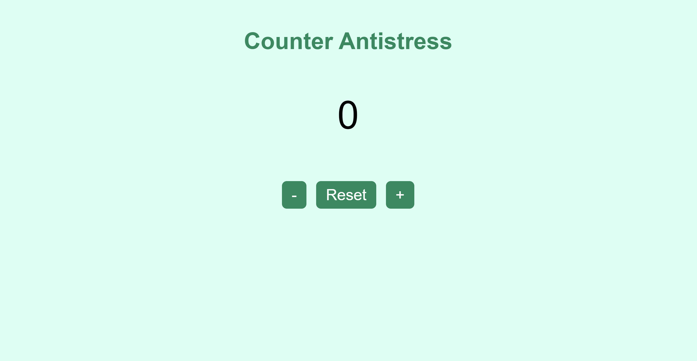

# Un counter anti-stress!

Questo progetto è stato creato per il corso Javascript Basics di start2impact.

Per costruire gli elementi a schermo, è stato usato solo Javascript, lasciando vuoto il body del file html.
Sono presenti tre bottoni che permettono al counter di aumentare, diminuire e ressettare il conteggio che può anche essere negativo.

Quando è stata richiesta la costruzione del counter, non avevo ben in mente come impostarlo, ma mentre cercavo delle idee mi sono accorta che trovavo molto rilassante il click del mio mouse e da lì, l'idea di trasformarlo in un counter dove magari poter unire il famoso "contare fino a dieci" al suono del mouse. Il counter non ha un limite, quindi se dieci non basta, si può andare ad oltranza o resettare e ricominciare.

[Rilassati e respira!](https://counter-antistress.netlify.app/)

